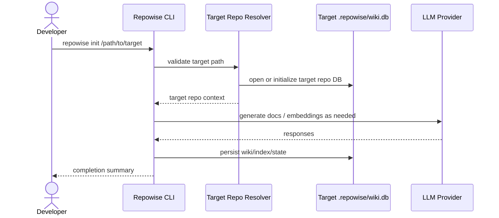
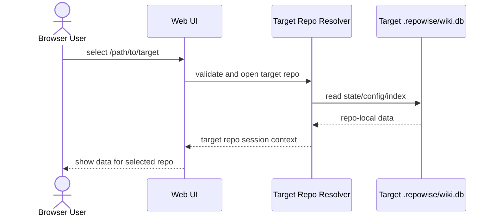
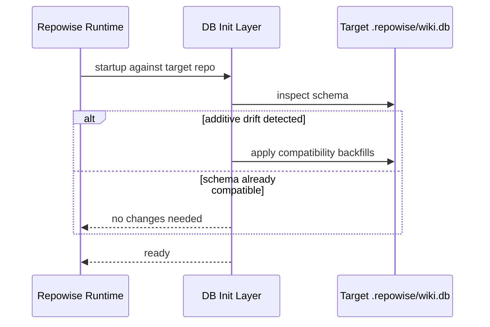

# Repowise Product Spec

This document is the standalone product spec for Repowise. It consolidates the prior architecture/design document and the setup/implementation plan into one source-of-truth.

Path placeholders used below:
- `<repowise-repo>`: the standalone Repowise checkout
- `<source-repo>`: the source checkout used to copy or derive the original Repowise baseline
- `<target-repo>`: any repository that Repowise operates on

## Part 1: Design

### Executive Summary

- Problem being solved:
  Repowise is currently usable only through repo-local installs and patched files inside `hypercopy/.venv/site-packages`. That makes it fragile, difficult to maintain, and hard to reuse across other repositories.
- Recommended architecture:
  Create a dedicated standalone `repowise` repository as the source-of-truth for the Repowise application code, packaging, CLI, MCP server, and Web UI. Repowise will run against arbitrary target repositories passed at runtime.
- Why this shape is preferred now:
  It centralizes application code while preserving per-target-repo state in each target repo's `.repowise/` directory. This removes hidden dependency on `pip` installs inside individual repos and makes future maintenance explicit.
- What can still fail in production first:
  Extraction may miss behavior currently encoded in patched installed files, Web UI startup may assume an install layout that no longer exists, and existing per-repo MCP configs may continue pointing at stale binaries.

### Assumptions

Hard constraints:
- The standalone repo must live in its own dedicated checkout, referred to in this document as `<repowise-repo>`.
- Repowise must be runnable from the standalone repo without requiring target repos to install Repowise via `pip`.
- Both CLI and Web UI must operate on a target repo path chosen at runtime.
- Per-target-repo persistence remains inside the target repo's `.repowise/` directory.

Working assumptions:
- The currently working behavior inside `hypercopy` is the baseline to preserve, including local fixes for schema compatibility and provider support.
- A standalone Repowise repo can maintain its own virtualenv and developer dependencies.
- MCP clients in target repos can point to a shared executable path in the standalone repo.
- Provider defaults may differ per target repo, so target-local config must remain supported.

### Requirements

#### Functional Requirements

1. A developer can run `repowise init /path/to/target-repo` from the standalone Repowise repo and build or update the target repo's `.repowise/` state.
2. A developer can start the Web UI from the standalone repo and point it to a target repo path.
3. A target repo can configure MCP to use the standalone Repowise checkout instead of a repo-local install.
4. Repowise must preserve compatibility with existing target repo `.repowise/` stores, including `wiki.db`, `state.json`, and target-local `config.yaml`.
5. Provider and model selection must work when invoked from the standalone repo against another repo.
6. The standalone repo must become the only maintained source-of-truth for Repowise application code.

#### Non-Functional Requirements

- Maintainability:
  No continued dependence on patched files inside another repo's `.venv/site-packages`.
- Compatibility:
  Existing `hypercopy/.repowise/` data must remain readable and writable.
- Isolation:
  Application code must live only in the standalone repo; per-target-repo indexes and state must live only in the target repo.
- Operability:
  CLI, Web UI, and MCP must share one target-repo resolution model.
- Migration safety:
  Migration should be incremental and verifiable against `hypercopy` before other repos are adopted.

### Proposed Architecture

#### System Context

Repowise becomes a standalone developer tool and application. Its code is hosted in one shared repo and executed from there. At runtime it operates on a selected target repo, reading and writing that repo's `.repowise/` directory. The main actors are:

- `E1 Developer` running CLI commands from the standalone repo
- `E2 Web UI user` selecting a target repo path
- `E3 MCP client` connected through repo-specific config
- `E4 External model providers` such as xAI, OpenAI, Gemini, Anthropic, or Ollama

#### Bounded Contexts / Modules / Services

| Component | Responsibilities | Owns Data | Interfaces | Notes |
| --- | --- | --- | --- | --- |
| Standalone Repowise Repo | Application source, packaging, CLI, MCP, Web UI | Its own code and local dev config | console scripts, Web UI launch, MCP entrypoint | Lives at `<repowise-repo>` |
| Target Repo Adapter Layer | Resolve target repo, locate `.repowise/`, load target config/state | none | path resolution API used by CLI, UI, MCP | Must be shared by all launch surfaces |
| Target Repo State | Repo-local wiki DB, state, generated artifacts, target defaults | `.repowise/` under target repo | filesystem | Never moved into standalone repo |
| Provider Layer | LLM and embedding providers, auth, model defaults | transient credentials only | provider interface | Includes first-class `xai` support |
| Schema Compatibility Layer | Ensure older target repo DBs can be opened and updated | target repo DB migrations/backfills | DB init / startup hooks | Must preserve existing local data |

#### Integration Model

- CLI -> Target Repo Adapter:
  synchronous command; query and command; fail fast on invalid path; no retries.
- Web UI -> Target Repo Adapter:
  synchronous selection and session setup; fail with visible validation error.
- MCP -> Target Repo Adapter:
  synchronous per-request resolution using configured target repo path; no hidden repo-local install assumptions.
- Provider Layer -> External LLM APIs:
  synchronous request/response from application point of view; retries and rate limits provider-specific; idempotency handled at the document generation level where applicable.
- Schema Compatibility Layer -> Target Repo DB:
  synchronous startup-time compatibility checks and additive backfills; no destructive migrations in first delivery.

#### Runtime Propagation Contract

The selected target repo must be pinned before the long-lived runtime starts. The launch surface is responsible for resolving the target repo first, then passing that identity into the runtime explicitly instead of letting the runtime infer it from cwd.

- `repowise init <target-repo-path>`:
  resolves the target repo in the CLI command, creates `<target>/.repowise/` when initialization requires it, and writes state only for that target repo.
- `repowise serve <target-repo-path>`:
  resolves the target repo in the CLI command, sets explicit runtime state for the FastAPI process, and starts the API/Web UI against that target repo only.
- `repowise mcp <target-repo-path>`:
  resolves the target repo in the CLI command and passes the repo path into the MCP server factory or run function.
- FastAPI startup:
  re-validates the target repo, requires an existing `.repowise/` directory for read-only surfaces, and binds DB/config/state access to that repo-local path.
- MCP lifespan:
  re-validates the target repo, requires an existing `.repowise/` directory for read-only tool access, and uses the target repo's `wiki.db` instead of a global or cwd-derived DB.

Explicit invariants:

- CLI, Web UI, and MCP must all use the same resolver module and path derivation logic.
- Read-only surfaces must not create `.repowise/` as a side effect.
- `init` is the only first-delivery launch surface that may create `.repowise/` automatically.
- A provided target repo path always wins over cwd inference or global database fallback.

#### Security Boundaries and Trust Zones

- `Z1 Local developer environment`:
  developer shells, CLI invocation, and local browser sessions.
- `Z2 Standalone Repowise runtime`:
  Python process, Web UI server, MCP server, provider clients.
- `Z3 Target repo data plane`:
  target repo `.repowise/wiki.db`, `state.json`, `config.yaml`, generated editor files.
- `Z4 External provider APIs`:
  xAI, OpenAI, Gemini, Anthropic, Ollama endpoints.

Security rules:
- Provider API keys remain environment-driven or explicit configuration; they are not copied into target repos unless intentionally stored there.
- Target repo filesystem access is scoped by the selected path and should never default implicitly to the standalone repo's own working tree.
- MCP launch configs should reference the standalone binary path but retain explicit target repo paths.

#### Error Handling and Resiliency

- Invalid target repo path:
  fail immediately with a clear validation error in CLI, UI, and MCP logs.
- Missing `.repowise/` directory in target repo:
  create it when safe, otherwise present a precise initialization message.
- Older target repo DB schema:
  use additive compatibility backfills during DB initialization; do not require manual DB recreation for expected legacy drift.
- Provider misconfiguration:
  fail with provider-specific validation errors that name missing keys or unsupported settings.
- Partial migration:
  allow target repos to continue using their existing `.repowise/` data even before every MCP config has been updated.

### DFD

- External Entities:
  - `E1 Developer`
  - `E2 Browser User`
  - `E3 MCP Client`
  - `E4 LLM Provider`
- Processes:
  - `P1 CLI Entrypoint`
  - `P2 Web UI Server`
  - `P3 MCP Server`
  - `P4 Target Repo Resolver`
  - `P5 Index / Wiki Engine`
  - `P6 Provider Gateway`
- Data Stores:
  - `D1 Standalone Repowise Source Repo`
  - `D2 Target Repo .repowise/wiki.db`
  - `D3 Target Repo .repowise/state.json`
  - `D4 Target Repo .repowise/config.yaml`
- Trust Zones:
  - `Z1 Local Workstation`
  - `Z2 Standalone Repowise Runtime`
  - `Z3 Target Repo State`
  - `Z4 External Provider APIs`
- Flows:
  1. `E1 -> P1`: run `repowise init /path/to/target-repo`
  2. `E2 -> P2`: choose target repo path in Web UI
  3. `E3 -> P3`: send MCP tool request
  4. `P1/P2/P3 -> P4`: resolve target repo path and locate `.repowise/`
  5. `P4 -> D2/D3/D4`: read or initialize target repo state
  6. `P5 -> P6`: request model generation or embeddings
  7. `P6 -> E4`: call provider API
  8. `P5 -> D2/D3/D4`: persist wiki/index/state updates

### Sequence Diagrams

#### CLI Init Against Another Repo



#### Web UI Session Against Another Repo



#### Compatibility Backfill On Existing Target Repo



### Domain Model

| Type | Kind | Owned By | Key Fields | Invariants | Relationships |
| --- | --- | --- | --- | --- | --- |
| StandaloneRuntimeConfig | Value Object | Standalone Repowise Repo | provider defaults, dev paths, UI settings | never contains target repo state | used by CLI, UI, MCP |
| TargetRepoContext | Aggregate | Target Repo Resolver | repo_path, repowise_dir, db_url | must point to one target repo only | owns access to target repo state |
| TargetRepoState | Aggregate | Target Repo State | wiki.db, state.json, config.yaml | data belongs to exactly one target repo | referenced by context |
| ProviderSelection | Value Object | Provider Layer | provider, model, env source | precedence order is deterministic | derived from CLI/UI/config/env |
| CompatibilityPlan | Value Object | Schema Compatibility Layer | table, missing_columns, backfills | additive-only in first migration phase | applied to target DB |

Lifecycle ownership:
- Only the standalone Repowise runtime creates or mutates application code and packaging.
- Only the target repo context may read or mutate the target repo's `.repowise/` data.
- Provider selection is resolved at runtime and must not silently drift across launch surfaces.

### Contracts

#### CLI Contract Candidates

- Command:
  `repowise init <target-repo-path>`
- Purpose:
  build or update a target repo's Repowise state from the standalone repo.
- Auth rule:
  local filesystem access plus provider credentials from environment/config.
- Input:
  explicit target repo path, plus provider/model overrides as flags.
- Output:
  terminal summary and updated target repo `.repowise/` state.
- Error model:
  invalid target path, missing provider keys, schema incompatibility, provider API failure.
- Idempotency:
  repeated runs against the same target repo should converge on updated state rather than duplicate state.

#### Web UI Contract Candidates

- Action:
  select target repo path in UI or pass target repo path as a launch parameter.
- Purpose:
  browse and operate on one target repo at a time.
- Auth rule:
  local user with access to target repo path and provider credentials.
- Error model:
  invalid path, inaccessible repo, provider/config errors surfaced in the session.

#### MCP Contract Candidates

- Launch contract:
  repo-local MCP config points to the standalone Repowise executable and passes an explicit target repo path.
- Purpose:
  keep target repo context explicit while centralizing application code.
- Compatibility note:
  existing per-repo `.mcp.json` files must be updated during migration.

### Storage Model / Persistence Strategy

| Store | Role | Owned By | Data Shape | Indexes | Retention | Notes |
| --- | --- | --- | --- | --- | --- | --- |
| `<repowise-repo>` | application source | Standalone Repowise Repo | code, scripts, package config | git only | indefinite | no target repo data here |
| `<target>/.repowise/wiki.db` | system of record for wiki/index | Target Repo State | SQLite tables and FTS | existing schema + additive compatibility | target-defined | must remain per target repo |
| `<target>/.repowise/state.json` | sync state | Target Repo State | provider/model/commit counters | none | target-defined | preserved in place |
| `<target>/.repowise/config.yaml` | target defaults | Target Repo State | provider/model/embedder and repo-specific settings | none | target-defined | survives standalone migration |

Migration and backfill plan:
- Phase 1:
  read existing target repo DBs in place.
- Phase 2:
  apply additive compatibility backfills for known schema drift during initialization.
- Phase 3:
  validate that standalone Repowise can run against `hypercopy/.repowise/` without reindexing from scratch unless requested.

Consistency model:
- Target repo `.repowise/` is the sole source of truth for that repo's Repowise state.
- Standalone Repowise code never stores another repo's index state in its own repo.

### Deployment Architecture

- Runtime units:
  - CLI process
  - Web UI server
  - MCP server
- Scaling model:
  local single-user developer tooling; no distributed runtime assumed in the first iteration.
- Secret distribution:
  environment variables on the local workstation, with optional target repo config for non-secret defaults.
- Failure domains:
  standalone repo codebase, target repo filesystem, target repo SQLite DB, external provider APIs.
- Recovery approach:
  rerun commands against the target repo after fixing config or provider issues; keep target repo data isolated so one repo's failures do not corrupt another's state.

### ADRs

#### Title
Use a standalone Repowise repo with explicit target repo paths

##### Status
Accepted

##### Context
Repowise currently depends on repo-local pip installs and patched site-packages, which prevents clean maintenance and reuse across multiple repos.

##### Decision
Create `<repowise-repo>` as the sole source-of-truth repo and require CLI, Web UI, and MCP to operate against explicit target repo paths.

##### Consequences
Maintenance becomes centralized and explicit. Migration requires careful extraction of currently working behavior and config updates in target repos.

##### Alternatives Considered
- Extract-and-own fork from current installed state inside a target repo:
  faster initially but preserves accidental structure.
- Thin launcher over pip-installed Repowise:
  does not satisfy the goal of independent maintainability.

#### Title
Keep `.repowise/` state inside each target repo

##### Status
Accepted

##### Context
Repowise indexes, state, and generated artifacts are inherently target-repo-specific.

##### Decision
Preserve `<target>/.repowise/` as the persistence boundary for each repo.

##### Consequences
One shared application codebase can serve many repos without cross-repo data contamination.

##### Alternatives Considered
- Centralize all repo state inside the standalone Repowise repo:
  rejected because it couples data ownership across repos and complicates isolation.

#### Title
Use additive compatibility backfills instead of destructive migration

##### Status
Accepted

##### Context
Existing target repos already have `.repowise/wiki.db` files with schema drift.

##### Decision
Apply startup-time additive compatibility backfills for known schema changes in the first migration.

##### Consequences
Existing repo-local data remains usable. Migration logic becomes part of the maintained standalone repo.

##### Alternatives Considered
- Force DB recreation:
  simpler code path but too destructive for an incremental migration.

### Risks / Trade-offs

- The highest-risk assumption is that the current working Repowise behavior can be reconstructed cleanly from installed code and local patches without missing hidden dependencies.
- The first likely breakpoint is launch-surface inconsistency: CLI may work before MCP or Web UI if path resolution is not centralized.
- Another likely breakpoint is provider behavior drift, especially for the local `xai` support that is currently not part of upstream Repowise.
- Operator burden increases temporarily during migration because per-repo MCP configs need to be repointed.
- The main trade-off is slower initial delivery in exchange for a clean standalone architecture that can be maintained long-term.

### Recommended Next Steps

1. Create the standalone repo skeleton at `<repowise-repo>` with explicit package, CLI, and runtime layout.
2. Extract the currently working Repowise source behavior from the local installed package into real maintained source files.
3. Move the compatibility and `xai` provider fixes into first-class source modules in the standalone repo.
4. Introduce one shared target-repo resolver used by CLI, Web UI, and MCP.
5. Validate the standalone repo against `hypercopy/.repowise/` before repointing other repositories.
6. Update per-repo MCP configs to use the standalone executable path.

## Part 2: Implementation Plan

> **For agentic workers:** REQUIRED SUB-SKILL: Use superpowers:subagent-driven-development (recommended) or superpowers:executing-plans to implement this plan task-by-task. Steps use checkbox (`- [ ]`) syntax for tracking.

**Goal:** Deliver `<repowise-repo>` as the standalone source-of-truth repo for Repowise application code, packaging, CLI, MCP, and Web UI runtime wiring, while keeping each target repo's `.repowise/` state in place.

**Architecture:** Use the approved standalone design plus the currently working Repowise runtime as the implementation baseline. The standalone repo owns code and packaging. Target repos continue to own `.repowise/` data. CLI, MCP, and Web UI must share one explicit target-repo contract.

**Tech Stack:** Git, Python packaging, local filesystem migration, repo-local SQLite state, Repowise CLI/Web UI/MCP runtime, provider integrations

---

### Task 1: Bootstrap The Standalone Repo

**Files:**
- Create: `<repowise-repo>/.gitignore`
- Create: `<repowise-repo>/README.md`
- Create: `<repowise-repo>/PROD_SPEC.md`

- [ ] **Step 1: Create the repository directory and initialize git**

Run:

```bash
mkdir -p <repowise-repo>
git -C <repowise-repo> init
```

Expected: empty git repo initialized at `<repowise-repo>`

- [ ] **Step 2: Add a minimal `.gitignore`**

```gitignore
.DS_Store
.venv/
__pycache__/
*.pyc
.pytest_cache/
node_modules/
dist/
build/
.repowise/
```

- [ ] **Step 3: Add a minimal `README.md` describing the bootstrap state**

```md
# Repowise

Standalone source-of-truth repository for the Repowise application.

## Current Status

This repo is being bootstrapped from the approved standalone migration design.

## Initial Documents

- `PROD_SPEC.md`
```

- [ ] **Step 4: Create the combined product spec in the new repo**

Write one `PROD_SPEC.md` that contains:

```text
1. The standalone architecture/design
2. The implementation plan and sequencing
3. The runtime contract for CLI, MCP, and Web UI
4. The migration and verification strategy
```

Expected: one source-of-truth product spec exists in the new repo

### Task 2: Record Initial Repo Intent

**Files:**
- Modify: `<repowise-repo>/README.md`

- [ ] **Step 1: Document the target operating model in the README**

Add a section like:

```md
## Operating Model

Repowise code lives in this repo.

Target repos keep their own `.repowise/` folders for:
- `wiki.db`
- `state.json`
- `config.yaml`
- generated editor files

Repowise is run against target repos explicitly, for example:

```bash
repowise init /path/to/target-repo
```
```

- [ ] **Step 2: Verify the README reads cleanly**

Run:

```bash
sed -n '1,220p' <repowise-repo>/README.md
```

Expected: clear bootstrap description with no placeholders

### Task 3: Verify Bootstrap Artifacts

**Files:**
- Verify only; no code changes

- [ ] **Step 1: List the new repo contents**

Run:

```bash
find <repowise-repo> -maxdepth 3 -type f | sort
```

Expected: `.gitignore`, `README.md`, and `PROD_SPEC.md` are present

- [ ] **Step 2: Check git status in the new repo**

Run:

```bash
git -C <repowise-repo> status --short
```

Expected: newly created files are visible as uncommitted additions

### Task 4: Capture The Working Repowise Baseline

**Files:**
- Create or modify the standalone package files under `<repowise-repo>/src/repowise/**`
- Modify: `<repowise-repo>/pyproject.toml`

- [ ] **Step 1: Use the currently working Repowise runtime as the behavior baseline**

Reference sources:

- The installed working package inside `hypercopy/.venv/site-packages/repowise`
- The upstream standalone repo structure from `repowise-dev/repowise`

Expected extraction targets:

```text
1. Python package layout under src/repowise/{cli,core,server}
2. Packaging metadata and console script entrypoints in pyproject.toml
3. Provider modules, including xai support
4. Persistence/database modules, including schema compatibility backfills
5. CLI commands for init, update, serve, mcp, and supporting helpers
```

- [ ] **Step 2: Preserve the existing behavior surface before standalone-specific changes**

Verification:

```bash
find <repowise-repo>/src/repowise -maxdepth 3 -type f | sort
python -m repowise --help
```

Expected: the standalone repo exposes the real package tree and CLI command surface instead of a placeholder skeleton

### Task 5: Implement The Shared Target-Repo Contract

**Files:**
- Create or modify:
  - `<repowise-repo>/src/repowise/target_repo.py`
  - `<repowise-repo>/src/repowise/cli/helpers.py`
  - `<repowise-repo>/src/repowise/core/persistence/database.py`
  - `<repowise-repo>/src/repowise/cli/commands/init_cmd.py`
  - `<repowise-repo>/src/repowise/cli/commands/serve_cmd.py`
  - `<repowise-repo>/src/repowise/cli/commands/mcp_cmd.py`
  - `<repowise-repo>/src/repowise/server/app.py`
  - `<repowise-repo>/src/repowise/server/mcp_server/_server.py`

- [ ] **Step 1: Add one shared target-repo resolver**

The resolver must:

```text
1. Validate the target repo path exists and is a repo root
2. Resolve <target>/.repowise/
3. Return db/config/state paths for that target repo
4. Stay read-only by default
5. Only create .repowise/ when initialization explicitly requires it
```

- [ ] **Step 2: Make the explicit target path part of the CLI contract**

Required command shape for the first standalone delivery:

```text
repowise init <target-repo-path>
repowise serve <target-repo-path>
repowise mcp <target-repo-path>
```

Constraint:

```text
Do not silently default to the standalone repo cwd for these launch surfaces.
```

- [ ] **Step 3: Propagate the selected target repo into long-lived runtimes**

The CLI launch surface must pass the target repo into the runtime explicitly:

```text
1. serve: resolve target repo in the CLI command, set explicit runtime state, and start FastAPI against that target repo only
2. mcp: resolve target repo in the CLI command and pass repo_path into the MCP server factory/run function
3. app startup and MCP lifespan: re-validate the target repo, require an existing .repowise/ directory for read-only surfaces, and use the repo-local wiki.db path
```

Expected: FastAPI and MCP runtime startup no longer rely on cwd/global database fallback when a target repo is provided

### Task 6: Bring Compatibility And Provider Support Into First-Class Source

**Files:**
- Modify the extracted provider and persistence modules under `<repowise-repo>/src/repowise/core/**`

- [ ] **Step 1: Preserve existing target repo `.repowise/` compatibility**

Requirements:

```text
1. Existing hypercopy/.repowise/wiki.db must remain readable
2. Existing config.yaml and state.json must remain in place
3. Schema drift handling must remain additive-only
4. No destructive migration or forced DB recreation in the first delivery
```

- [ ] **Step 2: Keep xai provider support in the maintained standalone source**

Expected: provider selection from env/config still works against target-local config such as:

```yaml
provider: xai
model: grok-4-1-fast-reasoning
embedder: gemini
```

### Task 7: Verify Against The Hypercopy Target Repo

**Files:**
- Verify only; no required file changes

- [ ] **Step 1: Run focused contract tests for target-repo handling**

Test surface:

```text
1. target repo path validation
2. .repowise/ path derivation
3. explicit-path CLI requirements
4. DB URL derivation for target repos
5. MCP config generation pointing back to the standalone checkout
```

- [ ] **Step 2: Smoke-check the standalone CLI entrypoints**

Run commands like:

```bash
python -m repowise --help
python -m repowise mcp --help
python -m repowise serve --help
```

- [ ] **Step 3: Validate against the existing hypercopy target repo state**

Run at least one live verification against:

```text
<target-repo>/.repowise
```

Expected: the standalone repo can resolve and use the existing target repo state without moving it

### Task 8: Repoint MCP Consumers After Standalone Validation

**Files:**
- Modify target-repo MCP config only after standalone validation succeeds

- [ ] **Step 1: Generate MCP config that references the standalone repo explicitly**

Required properties:

```text
1. Explicit target repo path in args
2. Standalone executable or python -m repowise entrypoint
3. Any required PYTHONPATH or runtime environment needed to launch from the standalone checkout
```

- [ ] **Step 2: Keep target repos unchanged except for MCP repointing**

Constraint:

```text
Do not move target repo `.repowise/` data into the standalone repo.
```
